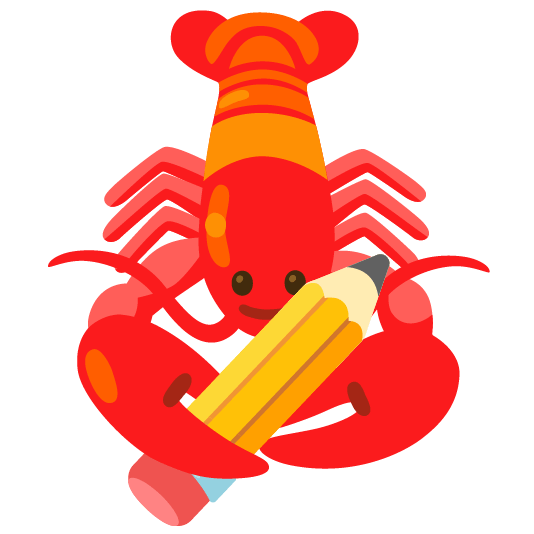

# Lagosta 🦞


[Ícone tirado do emoji kitchen da google](https://emojikitchen.dev/)

# Compilação
Requer `cargo`, `godot` e, opcionalmente, `docker`

## 1. Biblioteca

> _a lagosta veio do lago_

O projeto é composto de duas partes:
- Uma biblioteca GDExtension, escrita em Rust - `Lago`
- O projeto geral, feito em Godot - `Lagosta`

A gente usa um script auxiliar de build pra compilar a biblioteca.
Ele detecta se o sistema tem o docker instalado e usa ele pra compilar uma versão cross-platform.
(Ele baseia a biblioteca numa `glibc` mais antiga pra garantir compatibilidade com mais sistemas)

Se o sistema não tem docker instalado, ele builda nativamente mesmo.

#### ⚠️ Por favor, não builde uma release final do aplicativo _nativamente_ (sem o docker)

Para compilar a biblioteca basta rodar `rust/task_build.sh`
```bash
cd rust
# ./task_build.sh flags:
#         --win (builda pra windows),
#         --all (builda pra todas as plataformas),
#         --release (builda a versão release otimizada da biblioteca)
./task_build.sh
```

## 2. App Lagosta
Com o projeto aberto dentro da Godot, vá em `Project > Export` e exporte a versão desejada na pasta `bin/`.

**Não esqueça de desativar o export com debug para utilizar a versão release da biblioteca.**


